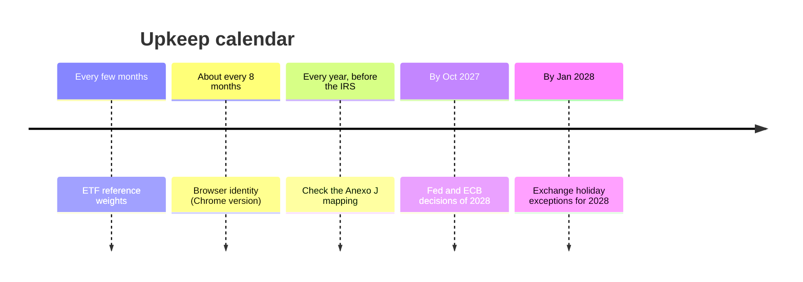

# Bluechip Board · open items

What is still to **decide**, **improve** or **watch**. Everything already done (the audit of 4 Oct 2026, its fixes, the follow-up of 7 Oct 2026 and every feature since) is in the git history. The full record of that work is in the previous version of this file: `git show 073d0c6:AUDIT-REMEDIATION.md`.

**State on 7 Oct 2026:**
- Tests: engine 278, site 469, resilience 76, all passing on Windows PowerShell 5.1 and PowerShell 7, locally and in GitHub Actions.
- A real run takes about one minute, with 79/79 sources answering.
- The repository is public since 7 Oct 2026: view and download only; issues, wiki, projects and discussions are off; workflow runs from people outside the project need approval. Nothing personal is in it or in its history (checked before publishing).

---

## 1. Decisions for you

Nothing is broken here: each item needs a choice from you before anything changes.

| ID | Item | Options |
|---|---|---|
| D1 | **Quadro 8A code.** The dividend export uses **E11** (no tax withheld in Portugal), the usual case with a foreign broker. | If a Portuguese entity withheld tax: **E10**, and fill in the *Imposto retido em Portugal* columns (`ANEXO_J.q8a`). |
| D2 | **Anexo J interpretations.** G20 for the UCITS ETFs (some advisers use G01); "País da fonte" = the issuer's country. | Confirm with an accountant; review the form every year (`ANEXO_J`). |
| D3 | **US macro series** (yield curve, high-yield spread, financial conditions). FRED blocks the script, and getting around its bot filter was not done. | (a) NFCI from the Chicago Fed's own CSV: checked, answers without a key. (b) The yield curve as Yahoo `^TNX` − `^IRX`, labelled approximate. (c) Leave it. The high-yield spread has no keyless public source. |
| D4 | **S&P 500 CAPE.** No public CSV with current data. | Add it only if such a source appears. |
| D5 | **"Below the 200-day average" alert** (moderate). It fires for weeks in ordinary corrections. | Make it informational, or show it only when there is no drop alert already. |
| D6 | **ECB decisions are `Medium`** in the calendar, so they raise no Overview alert (the Fed's are `High`). | Change to `High` for a 7-day warning. |
| D7 | **Top-holding news aliases** apply only to feeds without a fixed asset (`Dica`). | Let them override it: more precise, but some existing classifications change (and one engine test must be updated on purpose). |
| D8 | **Alphabet gross margin** is Unavailable: Alphabet reports no gross profit. | Show revenue − `CostOfRevenue`, marked as derived. |
| D9 | **Country exposure of SXR8 and EUNN** uses the index country (iShares gives no breakdown), flagged as approximate. | Keep, or find another source. |
| D10 | **Protecting `main`** (changes only through pull requests, merge only after the tests pass, auto-merge). Free since the repository became public (7 Oct 2026). | Turn it on in the repository settings, or keep merging by hand. |

---

## 2. Could be improved

| ID | Item | Where |
|---|---|---|
| I1 | **The ETFs have a single price source** (Yahoo, unofficial): no keyless Xetra alternative was found. Stooq blocks automated requests. Without Yahoo, the ETFs fall back to the previous run. | `Get-Serie` |
| I2 | **SEC "recent" list** reaches only ~3 years back for Alphabet (many Form 4 filings). The extra files that the JSON lists are not read. | `Get-ResultadosSEC` |
| I3 | **Duplicated rules:** the big-move thresholds (`MOV_LIM`) copy those in `alerts()`, and the rate-decision regex (`JUROS_RE`) copies `$DecisaoJuros` in the script. Change them together, or make one source. | template, section 1 |
| I4 | **Tab bar:** with ten tabs it fits from about 1,900 px; at 1,600–1,700 px it scrolls sideways. | CSS `.rail` |
| I5 | **Log scale** only on the ETF long-term chart; the stocks have no long-term chart. | ETFs tab |
| I6 | **Stress test** applies the S&P 500's peak and trough dates to every asset, not each asset's own. | `stress()` |
| I7 | **Test sample data** (`Tests\fixtures\bluechip-board-data.sample.json`, from 6 Oct 2026) ages. Checks that compare with today's date could start failing in CI before they do here. Refresh it from a recent `bluechip-board-data.json`, which holds public data only: check it has no `"backup"` key and no e-mail. | `Tests\fixtures\` |

---

## 3. Known limits (working as designed)

- **Browser backup permission.** A reopened page needs a user gesture before it can write the backup file again, so the first change asks for it. All `file://` pages share one `localStorage`.
- **Fees.** The realised gain in the register does not deduct fees. They count in the XIRR and in *Despesas e encargos*. The sell simulation leaves out fees, loss offsetting and *englobamento*.
- **Dividends (Quadro 8A).**
  - Yahoo gives ex-dates only, so the year is the ex-date's, and the last 45 days of the year are flagged `PAY_DATE_UNKNOWN`.
  - The US withholding is a 15 % estimate.
  - The euro amounts are a reference: the real ones are your broker's.
  - The data covers about 2 years back.
- **Fundamentals.**
  - The 4th-quarter EPS is the year minus 9 months, so it is approximate.
  - The 4th-quarter diluted shares are never derived.
  - Alphabet's diluted shares exist only since 2022.
- **News history** started on 6 Oct 2026. Until it fills up, *Big moves explained* shows "Before the news history" for older sessions.
- **Xetra year-end session.** Its time is set by Deutsche Börse each year, with no keyless calendar to read it from (rule plus `curtos` in `$Bolsas`).
- **Nasdaq price fallback** needs a previous run to compare with. On a fresh install with Yahoo down, the US stocks have no price: Unavailable, never guessed.
- **Live prices** come from Yahoo only. When it fails, the page keeps the latest prices and says the source is not answering.
- **Euro-area inflation:** on 6 Oct 2026 the ECB had HICP data only until Dec 2025. The page flags the month as not recent. If it stays like that, check whether the series moved to another key.

---

## 4. Risks to watch

| ID | Risk | What to do if it happens |
|---|---|---|
| R1 | **External formats change:** SEC (submissions JSON, `companyfacts`, 8-K Atom feed, filing headers), ECB series keys, iShares file layout, Yahoo (chart and spark), Nasdaq, Google News. | *Sources & method* shows each source's error after a run. Fix that collector. |
| R2 | **Yahoo spark endpoint** (live prices) could start asking for authentication, as `quote` did in 2023. | The daily run is unaffected (it uses the chart endpoint). Live prices then show "not answering". |
| R3 | **Port 47821** could be taken by another program. | The launcher warns. Change `Porta` in `$Vivo`. |
| R4 | **A browser could freeze a hidden tab for more than 5 minutes**, which ends the live process. | The page says *Live prices stopped*. Run the shortcut again. |
| R5 | **File growth.** The news history is limited to 15,000 stories and 400 days, and the Archive to 30 copies and ~300 MB. Each Archive copy carries the history (~2.5 MB). | Lower `$HistoricoDias`, or keep the history out of the Archive copies. |
| R6 | **`ConvertFrom-Json` on 5.1** with large SEC files (`companyfacts`, 3–4 MB today). | Switch to `companyconcept`, one request per tag. |
| R7 | **PowerShell 7 turns ISO date-time text into `DateTime`** when reading JSON. | Normalise any new date field read back from the data with `ConvertTo-IsoUtc`. |
| R8 | **PowerShell 7 .NET method calls** cost about 10 µs each, which adds up in new loops over thousands of items. | Hashtables by index, arrays, operators (see README → *Making a change safely*). |
| R9 | **The close taken from the quote** (when Yahoo's daily bar is late) relies on `regularMarketPrice` being the official close after the session. | It is checked within 50 % of the previous close, and named in the source row. The next run replaces it. |
| R10 | **SEC acceptance times:** if the EDGAR filing headers or the 8-K Atom feed change, earnings reaction sessions become Unavailable. | Find another SEC source of acceptance times. |
| R11 | **Site tests read the day's data file.** A source that was down at the last run can fail a check without a code bug. | Run the script again, then the tests. If needed, make the scenario fix its own data. |

---

## 5. Upkeep calendar

| When | What |
|---|---|
| Every few months | Refresh `$PesosReferencia` and each `Referencia` in `$ETFs` (reminder after 4 months). |
| About every 8 months | Update `$Script:UAChrome` and `$Script:UAData`: Chrome 154 on 7 Oct 2026, with a reminder after about 8 releases. |
| When a fund's top 10 changes | Add the holding to `$AliasesPosicoes`, with a test for a known false positive. The `Get-PosicoesSemAlias` reminder tells you. |
| As companies confirm them | Product events and other manual dates in `$Calendario`. Earnings dates come from Nasdaq. |
| By **Oct 2027** | Add the 2028 Fed and ECB decisions to `$Calendario`, from the official pages. The reminder comes 60 days ahead. |
| By **Jan 2028** | The exchange exception lists in `$Bolsas` end in 2027. The reminder comes at the start of the year. |
| Every year, before filing IRS | Compare `ANEXO_J` with the new Anexo J form and instructions: Quadros 9.2A, 9.4A and 8A; codes G01, G20, E10 and E11; the 365-day rule. |
| Now and then | Empty the Windows Recycle Bin of the old `BluechipBoard_snapshot_*` folders and `prompts\` once you no longer want them. Everything is in git. |

**To go back** to any earlier version: `git log`, then `git revert <commit>`. Your data is not in git, so a rollback never touches it.
