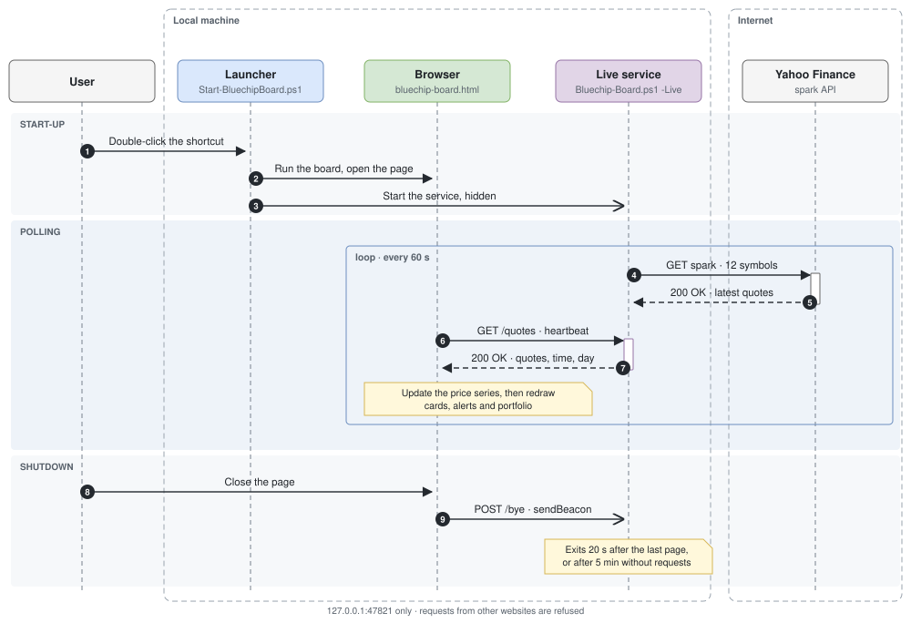
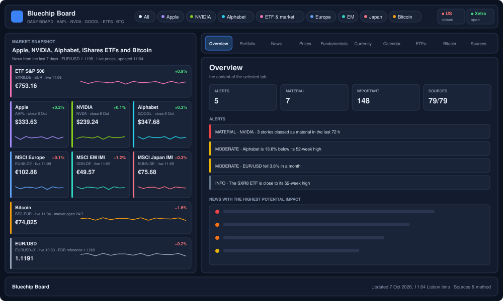
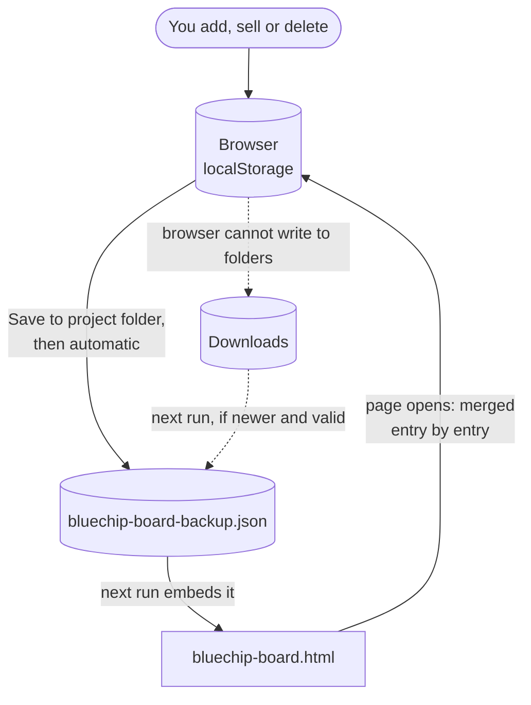
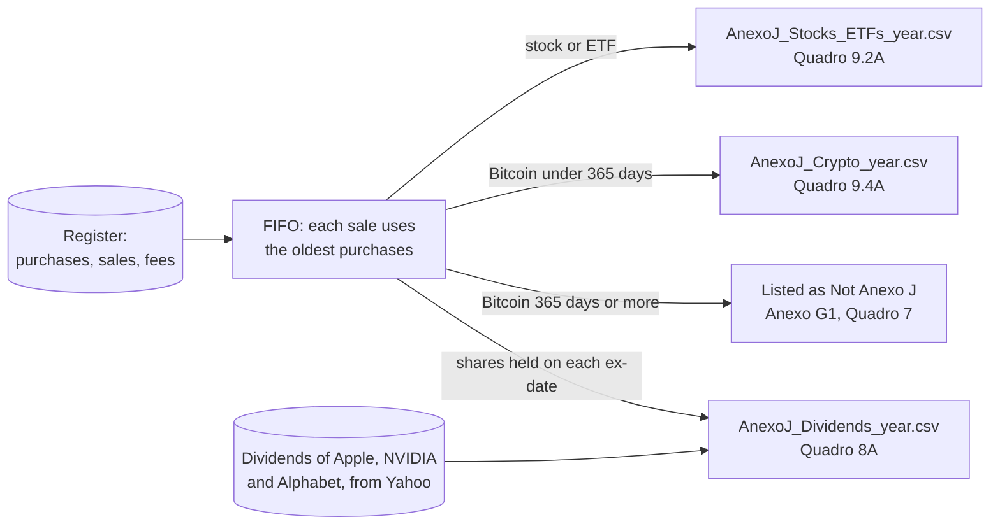
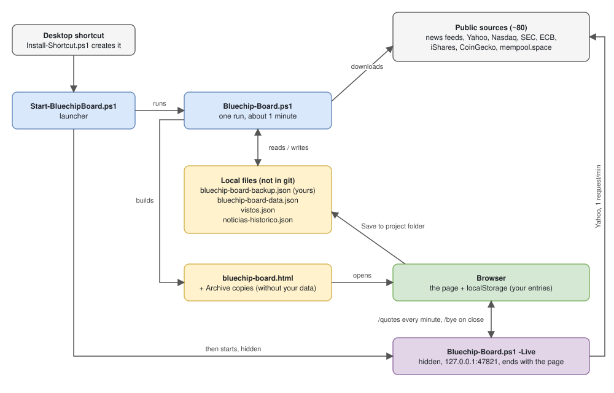
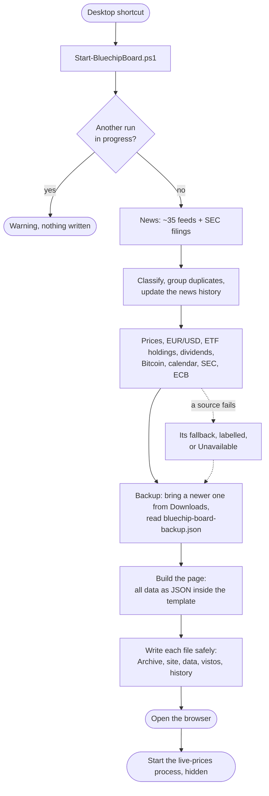
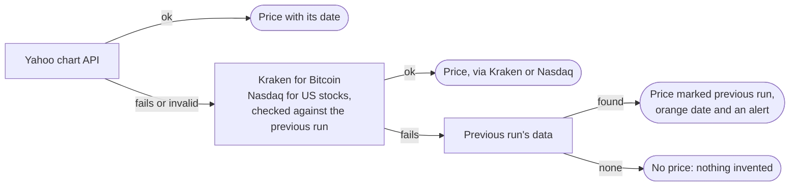
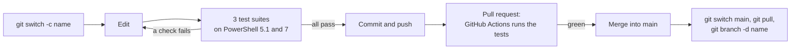

# Bluechip Board

A local dashboard for **Apple (AAPL), NVIDIA (NVDA), Alphabet (GOOGL)**, four **iShares ETFs** on Xetra, in euros (SXR8 S&P 500, EUNK MSCI Europe, IS3N MSCI EM IMI, EUNN MSCI Japan IMI), and **Bitcoin** in euros.

One PowerShell script collects news, prices and indicators from public sources and builds a single HTML page. On that page you track your portfolio, prepare your Portuguese tax files (Anexo J) and read the news that matters for your assets. Your data never leaves your PC.

> An educational, rule-based tool, not financial or tax advice.

**Contents:** [Quick start](#quick-start) · [The website](#the-website) · [Your portfolio and taxes](#your-portfolio-and-taxes) · [How it works](#how-it-works) · [Configuration](#configuration) · [Development](#development) · [Troubleshooting](#troubleshooting)

---

## Quick start

1. Double-click the **Bluechip Board** shortcut on the desktop.
2. A PowerShell window shows the progress (about one minute), then the website opens in your browser.
3. The window closes by itself when all went well. It stays open on an error or a warning: read it, then press **Enter**.
4. While the page is open, the prices refresh **every minute**. Closing the page stops this.

**Set up on a new PC** (Windows 10/11; PowerShell 7 recommended, Windows PowerShell 5.1 also works):

```powershell
git clone https://github.com/biazini/BluechipBoard.git
cd BluechipBoard
Copy-Item bluechip-board.config.example.json bluechip-board.config.json   # put your e-mail in it (for the SEC)
pwsh -ExecutionPolicy Bypass -File .\Install-Shortcut.ps1                 # creates the desktop shortcut
```

Then bring your `bluechip-board-backup.json` (and `noticias-historico.json`, see [Files](#files)) from the old PC into the folder, or load the backup in the website with **Restore backup**. The first run creates every other file.

**The SEC e-mail.** The SEC asks for a contact e-mail in each request. The script reads it from `bluechip-board.config.json` (`{ "secEmail": "you@example.com" }`), or from the `BLUECHIP_SEC_EMAIL` environment variable. It is never in git or on a command line. Without it, the board still works, without the SEC sources (company filings, past earnings, fundamentals).

### Live prices while the page is open

After a run without errors, the launcher starts a hidden background process (`Bluechip-Board.ps1 -Live`). It works like this:

- Every minute it asks Yahoo Finance for the latest price of every asset, plus the S&P 500, VIX, the 10-year yield and EUR/USD, in one request.
- The page fetches those prices from it and updates the snapshot cards, alerts, portfolio and open price charts.
- Each card shows the time of its latest trade (`live 15:42`), or `close 6 Oct` once the session is over.
- The header shows the state: *Live prices, updated 15:43*, *connecting…*, *the source is not answering*, *stopped* or *off*.



Its limits and safeguards:

- **Local only.** It listens on `127.0.0.1:47821` and answers only the board opened from the disk. Any other website is refused.
- **It ends with the page:** 20 s after the page is closed, or after 5 minutes without hearing from it. Clicking the shortcut again replaces it.
- **Nothing is saved.** Only the open page changes. The next run collects everything again.
- **Same rules as a run.** A quote more than 50 % away from the previous close, or in another currency, is not used. An asset the updates stop reaching is marked as behind.

---

## The website



| Tab | What you find there |
|---|---|
| **Overview** | Rule-based alerts (big daily moves, distance from the 52-week high, stale prices, EUR/USD, VIX, upcoming events, material news), the top stories of the last 72 h. Under a drop alert: your own rule from the investment policy and how often the asset fell that much before. |
| **Portfolio** | Your holdings, your return (XIRR) against the same money in SXR8, target allocation and the split of your next contribution, investment policy, stress test, real exposure (country, sector, currency) and concentration, projected dividends, the register of purchases and sales, the sell simulation, the tax exports and the backup. |
| **News** | Every story, classified material / important / moderate / noise, with filters, duplicates grouped, and a *Relevance to me* sort. |
| **Prices** | Performance in € or $ (1 month to 1 year) with markers for earnings, rate decisions and material news; returns and risk tables; *Big moves explained*; earnings reactions. |
| **Fundamentals** | Apple, NVIDIA and Alphabet from their SEC filings: the last 8 quarters, P/E and P/FCF against their own 10-year history (no look-ahead). |
| **Currency & Macroeconomics** | EUR/USD and how much of each stock's return came from it; S&P 500, VIX, 10-year yield; ECB deposit rate and euro-area inflation. |
| **Calendar** | Earnings, Fed/ECB decisions, the Bitcoin halving and other events, with countdowns. |
| **ETFs** | For each fund: description, top 10 and sectors, history since 2010 (linear or log), biggest drops, rolling returns, monthly simulator and a comparison of three ways to invest. |
| **Bitcoin** | Price, today's change, 7 days, volatility, **countdown to the next halving**; chart with averages, Fear & Greed, network data, the long-term chart, drops, rolling returns, simulator and the **365-day tax counter**. |
| **Sources & method** | The status of every source, maintenance reminders and how the classification works. |

Everything is shown in **Lisbon time**. Every price says which day it is from, and old data never passes for current. A banner appears when the page is more than 36 hours old.

---

## Your portfolio and taxes

### The register

**Portfolio → Purchases and sales.**

1. Choose the asset, purchase or sale, and the date. The price per unit (€) fills in with that day's close. US stocks are converted at that day's EUR/USD. Change it to the price you really paid.
2. Enter the quantity and, if you want, the **fee** (the € button in the *Fee* column also adds or changes it later).

How the register works:

- **Sales** use the oldest purchases first (FIFO), and a sale larger than what you held is refused.
- **Fees** count in your return and in *Despesas e encargos* of the tax export. The realised gain shown in the register is before fees.
- **Stock splits** are handled automatically, past and future.
- **Bitcoin purchases** go in the same register or in **Bitcoin → 365-day tax counter**. The counter shows when each purchase becomes tax-free.
- **Before you sell** simulates a sale today: the lots it would use, the gain and a 28 % estimate, with Bitcoin over 365 days exempt. Nothing is saved.

### Backup: your data stays on this PC

Your entries live in the browser (`localStorage`) and in **`bluechip-board-backup.json`** in this folder:



1. **Portfolio → Backup → Save to project folder.** The first time, choose this folder; another folder is refused. From then on every change is saved automatically while the page is open.
2. After reopening the page, the browser needs your permission again (a browser rule). The first change you make asks for it.
3. **If the browser cannot write to folders**, the backup goes to Downloads, and the next run brings the newest valid one into the project folder. The previous file is kept as `.previous.json`.
4. **Restore backup** merges any backup file by hand, of any version.

The backup also keeps your targets, policy, notes and fees. Only `bluechip-board.html` contains it, never the Archive copies or the data file. **Do not share `bluechip-board.html`** if you want to keep your portfolio private.

### Tax exports (IRS, Anexo J)

**Portfolio → Export for taxes.**

- **Export for Taxes (Anexo J)** gives two files for the chosen year:
  - `AnexoJ_Stocks_ETFs_<year>.csv` for Quadro 9.2A;
  - `AnexoJ_Crypto_<year>.csv` for Quadro 9.4A.
- **Export dividends (Quadro 8A)** gives `AnexoJ_Dividends_<year>.csv`.



What goes in them:

- **Only sales make rows.** One row per sale and purchase pair, by FIFO, with the euro prices you entered (no exchange rate applied). A year without sales gives files with headers only.
- **Bitcoin held 365 days or more** is exempt: it is listed as "Not Anexo J" (for Anexo G1, Quadro 7).
- **Dividends:** only Apple, NVIDIA and Alphabet pay them. The ETFs are accumulating, so they have none.
- **Mapping** (the `ANEXO_J` object in the template):

  | Asset | Code | País da fonte |
  |---|---|---|
  | US stocks | G01 | 840 |
  | ETFs (domiciled in Ireland) | G20 | 372 |
  | Dividends | E11 (no tax withheld in Portugal) | 840 |

- **The `Fill in manually` column** lists what the page cannot know: País da Contraparte, foreign tax, and fees you did not record.
- **`Status`**: rows to check say `REVIEW`, with the reason in `Flags`.

> **These are preparation files.** The Portal das Finanças does not import them: copy the rows into the form yourself. G20 vs G01 for UCITS ETFs and "País da fonte" are interpretations: confirm them every year with the official instructions or an accountant.

---

## How it works



*Edit it in VS Code with the Draw.io Integration extension (open `docs/architecture.drawio.svg`).*

**One run, step by step:**



Design rules:

- **Nothing is invented.** Every source can fail on its own. A failed price falls back to Kraken (Bitcoin), Nasdaq (US stocks, checked against the previous run), then the previous run, each labelled. Anything else shows **Unavailable** with the reason.
- **Validated data.** Wrong symbol or currency, zero or impossible prices are refused.
- **Safe writes.** Files are written to a temporary file and swapped in, so a run that fails halfway changes nothing. Two runs at once are blocked.
- **Your data stays local.** Only public data is downloaded. Your portfolio lives in the browser and the backup file.

**When a price source fails:**



### Files

| File | What it is | In git |
|---|---|---|
| `Bluechip-Board.ps1` | The script: configuration, collectors, classification and the website template (UTF-8 **with BOM**, LF). | yes |
| `Start-BluechipBoard.ps1` | Launcher used by the shortcut. | yes |
| `Install-Shortcut.ps1` | Creates or updates the desktop shortcut (`-Shell powershell` for Windows PowerShell 5.1). | yes |
| `Bluechip-Board.ico` | The shortcut's icon. | yes |
| `bluechip-board.config.example.json` | Template for `bluechip-board.config.json`. | yes |
| `Tests\`, `.github\workflows\tests.yml` | Test suites and their fixtures; GitHub Actions. | yes |
| `docs\*.drawio.svg` | Diagrams in draw.io: the architecture, the page layout and the live prices. | yes |
| `bluechip-board.config.json` | Your SEC e-mail. | **no** (personal) |
| `bluechip-board-backup.json` (+ `.previous.json`) | Your purchases, sales, targets, policy, notes and fees. | **no** (personal) |
| `bluechip-board.html` | The website. It embeds your backup. | **no** (personal; rebuilt every run) |
| `bluechip-board-data.json`, `vistos.json`, `noticias-historico.json`, `Archive\` | Outputs of each run, rebuilt or extended by the next one. | **no** (generated) |

The website, the data and the Archive are **built by the script**, so a fresh clone needs one run to have them. Only the news history (`noticias-historico.json`) cannot be rebuilt: it holds what the news feeds showed on past days. Copy it with your backup when you move to another PC.

### Data sources

| Data | Source | Fallback |
|---|---|---|
| News | Google News, Yahoo Finance RSS, Apple / NVIDIA / Google newsrooms, Fed, ECB, crypto press | — |
| Company filings, past earnings, fundamentals | SEC EDGAR and `data.sec.gov` (needs the e-mail) | previous run (180 / 120 days) |
| Prices, 1 year and since 2010 | Yahoo Finance chart API (unofficial) | Kraken, Nasdaq, previous run |
| Live prices (page open) | Yahoo Finance spark API (unofficial), one request a minute | latest prices kept, "not answering" |
| EUR/USD | Yahoo + ECB reference rates | long-term history, then ECB |
| ETF holdings | iShares files, one per fund | reference weights in the script |
| Dividends | Yahoo dividend events | previous run (180 days) |
| Earnings dates | Nasdaq | — |
| Euro area | ECB Data Portal (deposit rate, HICP) | previous run (30 days) |
| Bitcoin | CoinGecko, Alternative.me (Fear & Greed), mempool.space (network, halving) | halving estimated from the last one |

---

## Configuration

Everything you are expected to edit is in section **1. CONFIGURAÇÃO** at the top of `Bluechip-Board.ps1` (code comments are in Portuguese).

| Variable | What it holds |
|---|---|
| `$Ativos`, `$Mercado` | The assets (id, name, Yahoo symbol, fallbacks, currency) and the market references (S&P 500, VIX, 10-year yield). |
| `$ETFs`, `$PesosReferencia` | ETF metadata, the iShares file of each fund and the fallback weights. |
| `$Calendario` | Manual events (Fed/ECB decisions, product events). Earnings dates come from Nasdaq. |
| `$Bolsas` | Exchange hours and holiday exceptions (regular holidays are computed by rule). |
| `$Feeds`, `$SecEmpresas`, `$EmpresasRe`, `$AliasesPosicoes` | News feeds, SEC companies, asset keywords, the ETFs' top-holding aliases. |
| `$Vivo` | Live prices: port (`47821`), interval (60 s), time without a page (300 s), grace period (20 s). |
| `$Script:UAChrome`, `$Script:UAData` | The Chrome version in the browser identity and the day it was current. |

**Adding an asset** touches several places: the configuration, the template's `CO`, `PF`, `BOLSA_DE`, `ANEXO_J` and more. `Test-Engine.ps1` (check L9) fails and names every place still missing.

**Website constants** are in the template's JavaScript: alert thresholds (`alerts()`), period lengths (`PER`), `ANEXO_J`, `CONC_LIMIAR` (10 %), the colours (`:root` CSS tokens). After editing, run the script again.

### Parameters

| Parameter | Default | What it does |
|---|---|---|
| `-Days` | `7` | News window in days (1–30). |
| `-Folder` | script folder | Where the outputs are written. |
| `-SecEmail` | config file | The SEC contact e-mail (normally read from `bluechip-board.config.json`). |
| `-NoOpen` | off | Does not open the browser at the end. |
| `-ScheduleDaily`, `-Time` | `08:30` | Registers a daily Windows task (below). |
| `-Live` | off | The live-prices process (started by the launcher). |

Each has a Portuguese alias (`-Dias`, `-Pasta`, `-EmailSEC`, `-NaoAbrir`, `-AgendarDiariamente`, `-Hora`, `-AoVivo`).

**Daily run.** `.\Bluechip-Board.ps1 -ScheduleDaily -Time 08:30` registers the task **BluechipBoard**. It runs hidden with `-NoOpen`, also on battery, catches up if the PC was off, and reads the e-mail from the config file (never stored in the task). To remove it: `Unregister-ScheduledTask -TaskName BluechipBoard -Confirm:$false`.

### Maintenance

The script prints reminders (also in *Sources & method*) when something needs updating:

- reference weights older than 4 months;
- no Fed/ECB decision more than 60 days ahead;
- an exchange exception list that ended;
- a top-10 holding without a news alias;
- an old browser identity.

`AUDIT-REMEDIATION.md` has the dated list and the open items.

---

## Development

### Tests

Three suites, no internet needed, nothing in the project changed:

```powershell
pwsh -File .\Tests\Test-Engine.ps1                   # PowerShell side, offline (278 checks)
pwsh -File .\Tests\Test-Site.ps1                     # the website in headless Chrome/Edge (469 checks; -Only <scenario>)
pwsh -File .\Tests\Test-Resilience.ps1 -Shell pwsh   # failures, on a patched copy in %TEMP% (76 checks)
```

Use `powershell` (and leave out `-Shell pwsh`) for Windows PowerShell 5.1. Run all three on **both** shells before a change goes in. GitHub Actions does the same for every push to `main` and every pull request.

- **`Test-Engine`** loads sections 1–2 of the script and replaces downloads with canned answers.
- **`Test-Site`** builds a test page from the template and the latest `bluechip-board-data.json`, or `Tests\fixtures\bluechip-board-data.sample.json` in a clone. Each scenario runs in a fresh browser profile through the `window.__BB_TEST__` hook. `taxBaseline` compares the tax CSV files byte by byte with `Tests\fixtures\taxBaseline\`.
- **`Test-Resilience`** runs the script with every download blocked. It covers fallbacks, the backup from Downloads, a failed run, the scheduled task (dry run), the live-prices process on a test port and the shortcut installer (into a test folder).

### Working with git

The GitHub repository `biazini/BluechipBoard` is the source of truth. It is **public**: anyone can view and download it, only the owner can change it (issues, wiki and discussions are off). Your data and the outputs never go into git (`.gitignore`), so nothing personal is published.



`git status` must never list your backup, the config file or an output. Use `git log` and `git revert <commit>` to go back: your data is not affected.

### Making a change safely

- **Encoding.** `Bluechip-Board.ps1` and the tests must stay **UTF-8 with BOM** (5.1 needs it), with LF line ends (`.gitattributes` enforces them).
- **The `<` escape.** It is built as `'\' + 'u003c'`. Typed in one piece, some editors turn it back into `<` and break the page's protection.
- **Lines the tests patch.** `Test-Resilience.ps1` replaces exact texts; rename one and update the test too:
  - `function Get-Url {`
  - the Downloads lookup
  - `Write-Passo 'Building the website'`
  - `# Horário das bolsas`
  - `foreach ($r in @(Get-DatasResultados)) {`
  - `-TaskName 'BluechipBoard'`
  - `$total -gt 300MB`
  - the `$Vivo = @{ … }` line
- **PowerShell 7 is slow on .NET method calls** (about 10 µs each on 7.6). In loops over thousands of items use hashtables by index, arrays and operators.
- **Windows PowerShell 5.1:** arrays out of a pipeline can become `{value, Count}` in JSON. Build pairs in a plain `foreach`.
- **Dates as text:** always `.ToString('yyyy-MM-dd', $Script:Inv)`.
- **Diagrams.** The flowcharts are Mermaid blocks in the Markdown (GitHub and VS Code draw them). The architecture, the page layout and the live prices are `docs/*.drawio.svg`, pictures that draw.io can edit. Keep them in step with the code.
- **Never edit the outputs** (`bluechip-board.html`, the data file): change the template and run again.

### Code map

`Bluechip-Board.ps1` has four sections:

1. **CONFIGURAÇÃO**
2. **FUNÇÕES DE APOIO**: the collectors, such as `Get-Url`, `Read-Feed`, `Measure-Noticia`, `Join-NoticiasDuplicadas`, `Get-Serie`, `Get-PesosETF`, `Get-Dividendos`, `Get-DadosBitcoin`, `Get-ResultadosSEC`, `Get-FundamentaisEmpresa`, `Get-SerieMacro`, and live prices `Start-ModoVivo`.
3. **MODELO DO SITE**: `Get-Plantilla`, the HTML, CSS and JavaScript.
4. **EXECUÇÃO**

In the template, the main names:

| Name | What it is |
|---|---|
| `D` | The embedded data. |
| `ATIVOS`, `MERC`, `FX`, `HIST` | The price series. |
| `carteira()` | The only FIFO calculation. |
| `pfDados`, `drawPf` | The portfolio. |
| `anexoJ`, `ANEXO_J` | The tax export and its mapping. |
| `juntaBackup`, `guardaFicheiro` | The backup. |
| `frescura` | Is a price current? |
| `alerts` | The alert rules. |
| `renderAll`, `showTab` | Drawing and navigation. |
| `aplicaVivo` | Live prices. |

**Portuguese names you will meet:**

| Name | Meaning |
|---|---|
| `ativos` | assets |
| `noticias`, `nivel` | stories, level |
| `fontes` | sources |
| `vistos` | seen |
| `carteira`, `compras`, `vendas`, `lotes` | portfolio, purchases, sales, lots |
| `pontos` | price points |
| `parcial` | intraday |
| `anterior` | previous run |
| `quedas` | drops |
| `vivo` | live |

---

## Troubleshooting

| Symptom | What to do |
|---|---|
| The window stays open, "Finished with problems" | Read the error or warning above it. One failing source does not cause this: it only shows in *Sources & method*. |
| "Bluechip Board is already running" | Another run (shortcut or scheduled task) is in progress. Wait for it. |
| "SEC … skipped" | Put your e-mail in `bluechip-board.config.json`. |
| A price says "previous run", or its date is orange | The source failed or is behind. Run again later. |
| "Live prices off" | The page was opened without the shortcut (by hand, from the Archive, after a scheduled run). Use the shortcut. |
| "Live prices stopped" | The background process ended (the PC slept for a long time, or it was replaced). Use the shortcut again. |
| Live prices never connect, "port 47821 … used by another program" | Change `Porta` in `$Vivo` and run the shortcut again. |
| Portfolio empty after clearing the browser | Run the script once (it embeds the backup), or use **Restore backup**. |
| "Some changes are not in the backup file yet" | Make a change and allow the browser's prompt, or click **Save to project folder**. |
| The tax CSV opens in one column in Excel | **Data → From Text/CSV**, delimiter `;`, locale Portuguese. |
| The shortcut is missing or points to an old folder | Run `Install-Shortcut.ps1` from the project folder. |
| Accented characters broken after editing | Save the script again as UTF-8 **with BOM**. |
